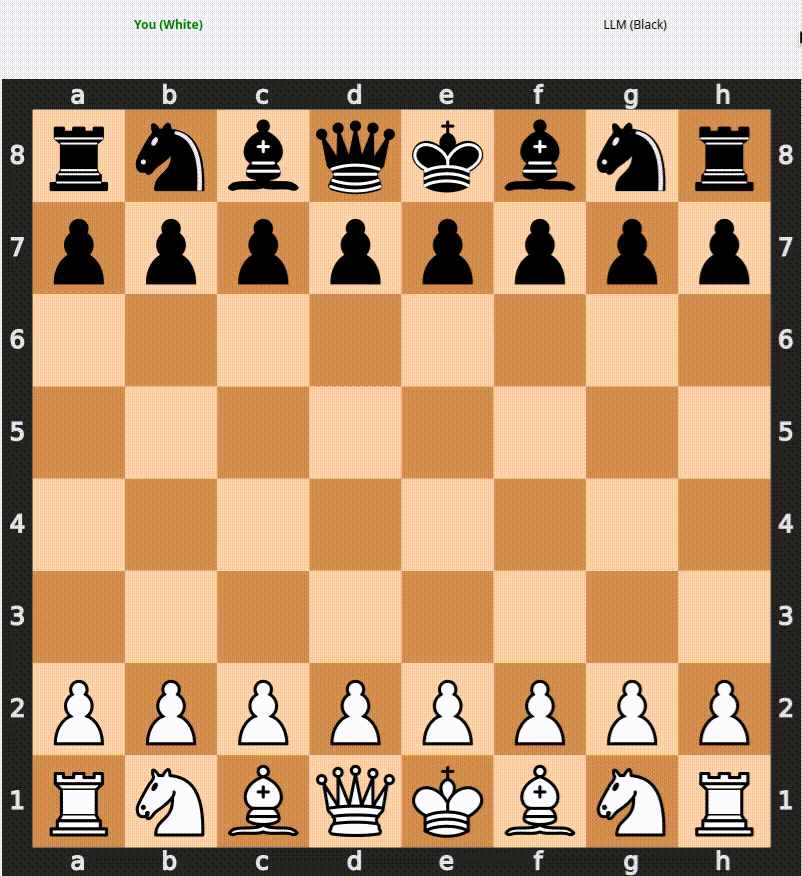

# ♟️ Hikaru-Inspired Chess LLM  

<p align="center">
  
  
  
</p>

---

## 📖 Overview  

This project explores **fine-tuning a lightweight language model (unsloth/LFM2-350M)** to emulate the chess-playing style of **Grandmaster Hikaru Nakamura**.  

- The model is trained to generate **UCI-standard moves** for compatibility with chess engines.  
- A **PyQt5 chessboard UI** is included, allowing you to play directly against the fine-tuned model.  
- Since it’s based on a **compact SLM**, it can run in **mobile apps or lightweight environments**.  
- The fine-tuning pipeline leverages **LoRA adapters** for efficient training, with **wandb** integration for experiment tracking, and **Modal** for scalable deployment/monitoring.  

---

## ✨ Features  

- 🎯 Fine-tuned on Hikaru Nakamura’s PGN games.  
- ♟️ Generates valid **UCI chess moves**.  
- 🖥️ Interactive **PyQt5 Chessboard UI**.  
- 📱 Deployable in **mobile or desktop apps**.  
- 🔧 Modular design: fine-tuning logic is separate (`slm/`), app runs independently (`app/`).  
- ⚡ LoRA-based fine-tuning for lightweight and efficient adaptation.  
- 📊 Experiment logging & monitoring with **wandb**.  
- ☁️ Scalable training/inference via **Modal**.  

---

## ⚙️ Project Structure  

```
├── app/                     # PyQt5 chessboard app
│   └── main.py
├── slm/                     # Datasets and finetuning scripts
│   ├── data/raw/            # PGN dataset (Nakamura games)
│   ├── scripts/             # Data + merge scripts
│   ├── Makefile             # Training/evaluation automation
│   ├── src/instruct         # Finetuning logic
│   └── ...
├── assets/                  # Demo GIFs and visuals
└── README.md
```

---

## 🚀 Getting Started  

### 1️⃣ Clone the repo  
```bash
git clone https://github.com/hridaya14/Chess-vlm.git
cd Chess-vlm
```

### 2️⃣ Install dependencies  

We recommend using [`uv`](https://github.com/astral-sh/uv) for package management.

```bash
uv sync
```

---

## 🏋️ Fine-Tuning Instructions  

All training steps are automated via the **Makefile** in the `slm/` directory.

### 📥 Download Hikaru’s games  

```bash
cd slm
make download-games
```

### 📝 Generate instruction dataset  

```bash
make instruction-dataset
```

### 🔧 Fine-tune the base model  

```bash
make fine-tuning
```

*(Default base model: `unsloth/LFM2-350M`)*  
> Uses **LoRA** adapters for efficient parameter-efficient fine-tuning.  
> Logs and metrics are automatically tracked via **wandb**.  

### 📊 Evaluate model checkpoint  

```bash
make evaluate
```

### 🔗 Merge final model  

```bash
make merge-model
```

---

## 🎮 Running the Chess App  

Once the model is fine-tuned and merged:

```bash
cd app
uv run main.py
```

This will launch the **PyQt5 chessboard**, where you can play against the Hikaru-inspired LLM.

---

## 🎥 Demo  

<p align="center">
  
</p>  

---

## 🧑‍💻 Development  

### Lint & Format  

```bash
cd slm
make lint
make lint-fix
make format
```

---

## 📌 Notes  

* The project is experimental and may not always reflect Hikaru’s exact style.  
* UCI move generation ensures compatibility with standard chess engines.  
* The app and model are modular — you can integrate the model into other frontends.  
* LoRA fine-tuning keeps training lightweight and fast.  
* Modal and wandb integration provide **scalable training** and **clear monitoring/logging**.  

---

## 📜 License  

MIT License – feel free to use, modify, and share.  

---

## 🙏 Acknowledgements  

* [Hikaru Nakamura PGN Mentor Dataset](https://www.pgnmentor.com/players/Nakamura.zip)  
* [Unsloth LFM2-350M](https://huggingface.co/unsloth/LFM2-350M)  
* [wandb](https://wandb.ai/) – experiment tracking  
* [Modal](https://modal.com/) – serverless ML scaling  
* Chess community for inspiration ♟️  
